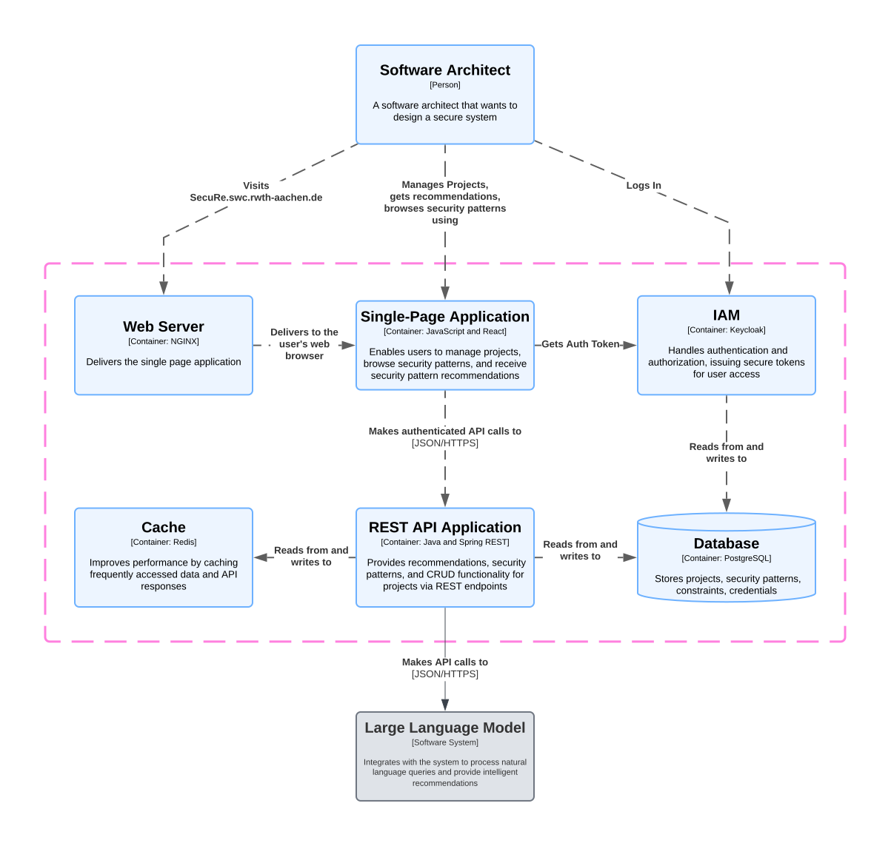

# SecuRe - A Recommender System for Secure System Design

## C4 Container Diagram

Below is the C4 container diagram for the SecuRe system:



> **Note**: This diagram illustrates the SecuRe system architecture, highlighting the interactions between its components:
>
> - **Single-Page Application (SPA)**: Built with JavaScript and React, it provides recommendation functionality via the user’s web browser.
> - **REST API Application**: Developed with Java and Spring, it exposes recommendation functionality through REST endpoints.
> - **Database**: A PostgreSQL database stores projects, security patterns, constraints and credentials.
> - **IAM (Keycloak)**: Handles authentication and provides secure access tokens.
> - **LLM (Language Model)**: Performs natural language processing.
> - **Web Server (NGINX)**: Delivers the SPA to users' browsers.
> - **Cache (Redis)**: Improves performance by caching API responses.

---

## Getting Started

Follow the steps below to set up and run the SecuRe system:

### Prerequisites

Ensure you have the following installed on your system:

- **Docker**
- **Docker Compose**
- **An OpenAI API Key** (see instructions below)

---

### Setting Up the Environment

1. **Clone the repository**:

   ```bash
   git clone <repository-url>
   cd <repository-folder>
   ```

2. **Configure the `.env` file**:
   - Locate the `.env` file in the project root directory. If it doesn't exist, create a new file named `.env`.
   - Add your OpenAI API key to the `.env` file in the following format:
     ```plaintext
     OPENAI_API_KEY=your_openai_api_key_here
     ```

---

### Generating an OpenAI API Key

1. Visit the [OpenAI Platform](https://platform.openai.com/).
2. Sign in or create an account if you don’t already have one.
3. Navigate to the **API Keys** section under your account settings.
4. Generate a new API key.
5. Copy the API key and paste it into the `.env` file as shown above.

> **Important**: Keep your API key secure and do not share it publicly.

---

### Running the System

You can use the provided run scripts to start the system easily:

#### For Linux/macOS (Bash)

Run the following script:

```bash
./run.sh
```

#### For Windows (PowerShell)

Run the following script:

```powershell
.\run.ps1
```

Both scripts automatically configure the system to use the `.env` file and start the application.

Alternatively, you can manually start the system using Docker Compose:

1. Open a terminal in the project directory.
2. Run the following command:
   ```bash
   docker compose --env-file ./.env up --build
   ```
3. Once the setup is complete, access the application at the URL specified in the terminal output (`http://localhost:5173`).
